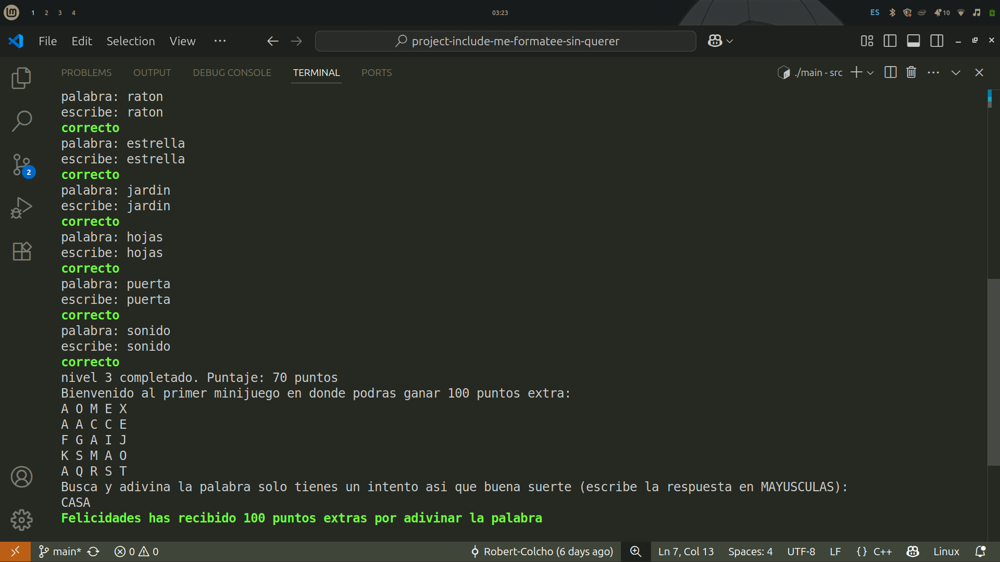

[](https://classroom.github.com/a/mi1WNrHU)
# Proyecto de C++ - [Type Master]

## Tematica y ambientacion del juego
Este juego está ambientado en un entorno educativo y de entrenamiento mental. El objetivo es mejorar la velocidad y precisión al escribir en teclado, con un estilo tipo consola en una terminal, diseñado para estudiantes o cualquier persona que quiera practicar mecanografía, cada nivel representa un reto con palabras cada vez más difíciles. Entre ciertos niveles, el jugador accede a minijuegos sorpresa que ponen a prueba otros aspectos como lógica y reflejos.

## 🕹️ Mecánica Principal
- El jugador selecciona desde un menú el nivel que desea jugar.
- Cada nivel contiene 7 palabras que deben ser escritas correctamente.
- Por cada acierto, el jugador gana 10 puntos, si falla pierde 20.
- Al completar el nivel, se muestra el total de puntos.
- Cada 3 niveles (nivel 3, 6 y 9), se activa un **minijuego** que puede otorgar puntos adicionales.

## 🎯 Idea General de la Jugabilidad
- Juego de consola basado en **entrada de texto**.
- Interfaz simple e intuitiva para navegar por el menú y elegir niveles.
- Los niveles aumentan progresivamente en dificultad, comenzando con palabras básicas como "sol" o "nube" y terminando con términos complejos y largos como "anticonstitucionalmente".
- Incluye **3 minijuegos** distintos:
- **Minijuego 1:** Adivinar una palabra oculta en una sopa de letras.
- **Minijuego 2:** Resolver una pista horizontal y vertical tipo crucigrama.
- **Minijuego 3:** Escribir palabras lo más rápido posible, midiendo el tiempo con un cronómetro.
- El puntaje se acumula y puede ser guardado.
- Opciones para mostrar y eliminar partidas guardadas desde el menú.

## 📚 Aplicación de los Temas Vistos
- Variables y tipos de datos: Uso de int, string, char y estructuras personalizadas (Game) para almacenar datos. Ejemplo: Variables option, playerName, level en menu.h y save.h.
- Estructuras condicionales (if, else, switch): Decisiones para navegación en menú y validación de respuestas. Ejemplo: switch en menu.h para elegir opción del menú; if-else en minijuegos para verificar respuestas.
- Ciclos (for, while, do-while): Iteraciones para mostrar niveles, palabras y contar tiempo. Ejemplo: for en levels.h para recorrer palabras, while en menú para esperar opción válida.
- Funciones: Código organizado en funciones con responsabilidad clara: guardar, cargar, jugar niveles, minijuegos. Ejemplo: saveGame(), loadGame(), playlevel(), minigame3().
- Estructuras de datos: Uso de struct Game para agrupar datos del jugador. Matrices multidimensionales para niveles y palabras (levels.h). 
- Manejo de archivos: Guardado y carga de partidas usando archivos de texto plano (games.txt). Ejemplo: lectura y escritura segura en save.h.
- Manejo de errores: Validaciones de apertura de archivos y opciones de menú. Mensajes claros ante errores en carga/guardado y entradas inválidas.
- Interfaz por consola: Menús y mensajes interactivos para el jugador. Uso de colores ANSI para retroalimentación visual (correcto/incorrecto).

## 🛠️ Consideraciones Técnicas del Desarrollo
- Lenguaje: **C++**
- Estructura modular con múltiples archivos `.h`:
- `menu.h`: Controla la navegación y selección de niveles.
- `entero.h`:es una funcion para manejar los posibles errores de datos invalidos en el codigo.
- `niveles.h`: Contiene las palabras por nivel y la lógica de evaluación.
- `minijuegos.h`: Incluye los tres minijuegos.
- `guardar.h:` Gestión completa de partidas mediante archivos.
- `funciontiempo.h`: Implementa funciones de tiempo como la cuenta regresiva.
- Lógica central agrupada en `main.cpp`, que solo llama a `menuGame()` para mantener el código limpio y organizado.
- No se utilizan librerías externas, lo que permite su compilación en cualquier entorno estándar de C++.
- Asegura portabilidad y legibilidad del código con comentarios claros en cada archivo.





## 📄 Descripción del Proyecto

Este proyecto consiste en un juego de mecanografía por consola titulado **Type Master**, cuyo propósito es ayudar al jugador a mejorar su precisión y velocidad al escribir. El jugador debe escribir correctamente las palabras que se le presentan en pantalla, organizadas en 9 niveles de dificultad creciente. 

Cada nivel contiene 7 palabras, y al completar ciertos niveles (3, 6 y 9), el jugador accede a un minijuego sorpresa que prueba otras habilidades como memoria, lógica o reflejos.

## 🎮 Explicación del Funcionamiento del Juego

- Iniciar una nueva partida o cargar una ya existente.  
- Seleccionar niveles con palabras para escribir. Por cada palabra correcta se suman puntos y por cada error se restan.  
- En los niveles 3, 6 y 9 se activan minijuegos adicionales para ganar puntos extra: una sopa de letras, un juego de pistas, y un reto de escritura rápida con cronómetro.  
- Guardar el progreso manualmente en cualquier momento desde el menú.  
- Consultar partidas guardadas o eliminarlas.  

Todo se maneja mediante menús e interacción por consola, haciendo el juego simple y accesible.


## Equipo

- **Nombre del equipo:** [#include]

### Integrantes del equipo

1. **Nombre completo:** [Diego Leonardo Melara Munguia]  
   **Carnet:** [00180825]

2. **Nombre completo:** [Robert Stanley Colocho Andrade]  
   **Carnet:** [00054625]
   
3. **Nombre completo:** [Devora Michel Galicia Castro]  
   **Carnet:** [00097325]

## Instrucciones de Ejecución

1. Clona este repositorio en tu máquina local:
   ```bash
   git clone [URL del repositorio]

2. Abre Visual Studio Code y carga la carpeta que contiene los archivos fuente del proyecto.  
3. Asegúrate de que todos los archivos `.h` estén en la carpeta junto con un archivo `main.cpp` que invoque la función `menuGame()`.  
4. Abre la terminal integrada en VSCode (`Ctrl + \``).
5. Compila el proyecto con un comando similar a:  
   ```bash
   g++ main.cpp -o typemaster

6. 
```bash
   en windows:
   ./typemaster.exe

   en linux:
   ./typeaster

